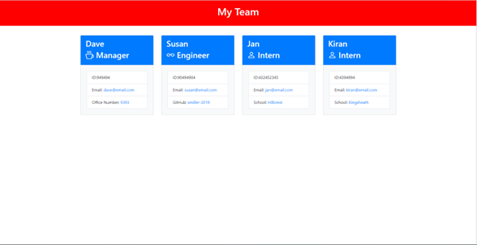

# Build-me-a-software-engineering-team

## Table of Contents

- [Description](#description)
- [Installation](#installation)
- [Usage](#usage)
- [License](#license)
- [Contributing](#contributing)
- [Tests](#tests)
- [Questions](#questions)

## Description

Allows the user to enter the names and details of their software engineering team for the following roles: Manager, Engineer and Intern.

## Installation

Type in npm install to install Inquirer and Jest.

## Usage

Type in node index.js and choose the role of the employee you would like to enter details about: Manager, Engineer or Intern. Once the role is selected, enter the specific details for that role. The user will be prompted at the end to select another role. This will continue untill the user selectsts 'Build my team', then the application will createae a webpage with carde details for each employeee.

The following image shows the results of using the 'Build me a Software Engineering team application:
Run command node index.js

Click on the video walkthough to see how to run, use and test the application:
[Walkthrough video](https://drive.google.com/file/d/1EAOKeaB9sy4PIY_jEDg8APU6ZmL4cIiB/view?usp=sharing)

## License

MIT License

Copyright (c) 2022 smiller-2019

Permission is hereby granted, free of charge, to any person obtaining a copy
of this software and associated documentation files (the "Software"), to deal in the Software without restriction, including without limitation the rights to use, copy, modify, merge, publish, distribute, sublicense, and/or sell copies of the Software, and to permit persons to whom the Software is
furnished to do so, subject to the following conditions:

The above copyright notice and this permission notice shall be included in all copies or substantial portions of the Software.

THE SOFTWARE IS PROVIDED "AS IS", WITHOUT WARRANTY OF ANY KIND, EXPRESS OR
IMPLIED, INCLUDING BUT NOT LIMITED TO THE WARRANTIES OF MERCHANTABILITY,
FITNESS FOR A PARTICULAR PURPOSE AND NONINFRINGEMENT. IN NO EVENT SHALL THE
AUTHORS OR COPYRIGHT HOLDERS BE LIABLE FOR ANY CLAIM, DAMAGES OR OTHER
LIABILITY, WHETHER IN AN ACTION OF CONTRACT, TORT OR OTHERWISE, ARISING FROM, OUT OF OR IN CONNECTION WITH THE SOFTWARE OR THE USE OR OTHER DEALINGS IN THE SOFTWARE.

## Contributing

GitHub Profile of Contributors: Please fork the repo and create a pull request as follows: 1. Fork the Project 2. Create your Feature Branch. 3. Commit your Changes. 4. Push to the Branch. 5. Open a Pull Request
Open a Github issue with the tag 'improvements'

## Tests

Type in npm test to use Jest to test the application.

## Questions

If there are any questions then you can contact me via:

Email: sue@myapp.com

GitHub Profile: [smiller-2019](https://github.com/smiller-2019/)

GitHub Repository: [smiller-2019](https://github.com/smiller-2019/)
